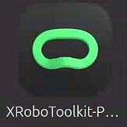

# Teleoperation and Recording

This guide covers the live teleoperation and recording workflow for HumanoidArena. It groups the maintained TWIST2 and SONIC entrypoints used with Isaac Lab.

## Prerequisites

Complete the environment setup first:

- [Environment setup](04_environment_setup.md)
- [IsaacLab command quickstart](../isaaclab_twist2_g1/docs/COMMAND_QUICKSTART.md)
- [TWIST2 teleoperation notes](../TWIST2/doc/TELEOP.md)

Before recording, check that these services and devices are available:

- PICO headset streaming through XRobotToolkit.
- Redis or the configured action transport used by the teleoperation server.
- Isaac Sim / Isaac Lab environment activated with access to `isaaclab_twist2_g1/assets`.
- Required TWIST2 checkpoints under `TWIST2/assets/ckpts/`.
- SONIC policy artifacts under `GR00T-WholeBodyControl/gear_sonic_deploy/policy/release` when using SONIC.

## 1. Start XRobotToolkit

Start XRobotToolkit on the Linux machine that receives headset pose data. Confirm that the headset pose is updating before launching any robot or simulator process.



## 2. TWIST2 Teleoperation

Start the TWIST2 upstream teleoperation process:

```bash
cd TWIST2
bash teleop.sh
```

If needed, edit the human height parameter in `TWIST2/teleop.sh` before launch:

```bash
actual_human_height=1.79
```

The PICO height estimate can be noisy, so the configured height is usually set slightly below the measured human height.

Alternative maintained server wrappers are available from the repository root:

```bash
bash isaaclab_twist2_g1/run_twist2_teleop_server.sh
bash isaaclab_twist2_g1/pico_server/run_twist2_teleop_server.sh
```

## 3. SONIC Teleoperation

For SONIC input, start the SONIC teleoperation server:

```bash
bash isaaclab_twist2_g1/run_sonic_teleop_server.sh
```

or from the Pico server directory wrapper:

```bash
bash isaaclab_twist2_g1/pico_server/run_sonic_teleop_server.sh
```

The SONIC runtime expects the encoder, decoder, and observation config to exist under the configured `SONIC_POLICY_ROOT`. See [Environment setup](04_environment_setup.md#sonic-policy-artifacts).

## 4. Start Isaac Lab Live Recording

From the repository root, launch the simulator-side live recording process.

TWIST2:

```bash
bash isaaclab_twist2_g1/run_twist2.sh
```

SONIC:

```bash
bash isaaclab_twist2_g1/run_sonic.sh
```

Open-door SONIC joint29 live inference / recording:

```bash
bash isaaclab_twist2_g1/run_sonic_joint29.sh
```

Most scripts keep task names, robot assets, recording directories, image streaming addresses, and replay paths near the top of the shell file. Review those variables before long recording runs.

## 5. Recording Outputs

Recording outputs are local runtime artifacts and are not part of the git release surface. They commonly live under:

```text
isaaclab_twist2_g1/recording_data/
isaaclab_twist2_g1/recording_debug_logs/
isaaclab_twist2_g1/replay_debug_logs/
```

Keep release-ready data in the Hugging Face dataset repository or another artifact store, not in this git repository.

## 6. Troubleshooting

If the robot does not move, verify the upstream teleoperation terminal first, then the Isaac Lab terminal:

- The headset pose stream is updating in XRobotToolkit.
- The TWIST2 or SONIC server is publishing actions.
- The Isaac Lab script uses the same backend, either `twist2` or `sonic`.
- The task and robot type match the recorded or live control profile.
- Required assets and ONNX policy files exist at the paths printed by the script.

More backend-specific details are in:

- [SONIC data flow analysis](../isaaclab_twist2_g1/docs/SONIC_DATA_FLOW_ANALYSIS.md)
- [SONIC troubleshooting checklist](../isaaclab_twist2_g1/docs/SONIC_TROUBLESHOOTING_CHECKLIST.md)
- [TWIST2 data format](../isaaclab_twist2_g1/docs/TWIST2_DATA_FORMAT.md)
- [SONIC data format](../isaaclab_twist2_g1/docs/SONIC_DATA_FORMAT.md)
